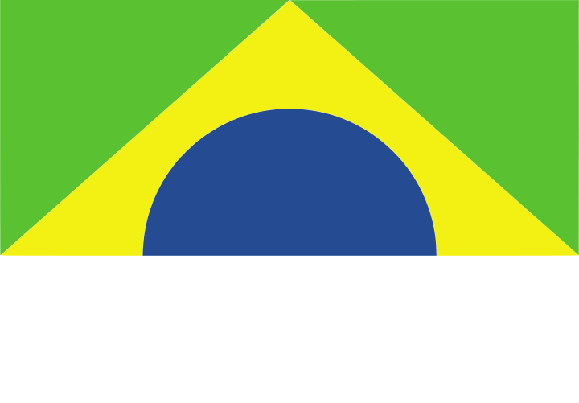

<div align="center">
  
  
  # Cívico - Portal de Transparência Governamental
  
  <p>
    <strong>Plataforma educativa e interativa para consulta de dados públicos brasileiros</strong>
  </p>
</div>

---

## 📋 Índice

- [Sobre o Projeto](#-sobre-o-projeto)
- [Sobre a ZettaLab](#-sobre-a-zettalab)
- [Funcionalidades](#-funcionalidades)
- [Tecnologias Utilizadas](#-tecnologias-utilizadas)
- [Pré-requisitos](#-pré-requisitos)
- [Instalação e Configuração](#-instalação-e-configuração)
- [Como Executar](#-como-executar)
  - [Método 1: Angular CLI](#método-1-angular-cli)
  - [Método 2: Docker](#método-2-docker)
- [Estrutura do Projeto](#-estrutura-do-projeto)
- [APIs Integradas](#-apis-integradas)
- [Licença](#-licença)

---

## 🎯 Sobre o Projeto

**Cívico** é uma aplicação frontend desenvolvida para promover a transparência governamental e educação cívica no Brasil. O projeto oferece uma interface intuitiva e responsiva para consulta de dados públicos, consumindo APIs externas para exibir informações sobre órgãos governamentais, licitações, dados demográficos e educação sobre a estrutura do Estado brasileiro.

### Objetivos Principais

- ✅ **Democratizar o acesso** a dados públicos governamentais
- ✅ **Educar cidadãos** sobre a estrutura do Estado brasileiro
- ✅ **Facilitar a fiscalização** de gastos e licitações públicas
- ✅ **Promover transparência** através de visualizações intuitivas
- ✅ **Empoderar cidadãos** com informações precisas e atualizadas

---

## 🏢 Sobre a ZettaLab

A **ZettaLab** é uma empresa especializada em soluções tecnológicas inovadoras, focada em transformação digital e desenvolvimento de software de alta qualidade. Com expertise em tecnologias modernas e metodologias ágeis, a ZettaLab atua em diversos setores, desenvolvendo projetos que impactam positivamente a sociedade.

Este projeto faz parte do **Desafio I - ZettaLab 2025/2**, uma iniciativa para desenvolver soluções que promovam cidadania digital e transparência governamental no Brasil.

**Missão:** Desenvolver tecnologias que simplifiquem o acesso à informação pública e fortaleçam a democracia participativa.

---

## ✨ Funcionalidades

### 🏠 **Início**
- Apresentação do projeto e seus objetivos principais
- Acesso rápido às funcionalidades principais (Busca, Análise e Educativo)
- Interface totalmente responsiva com identidade visual em cores da bandeira brasileira

### 🔍 **Busca de Dados Públicos**
- **Consulta de CEP** (via BrasilAPI)
  - Informações detalhadas de endereços
  - Validação automática de formato
  
- **Consulta de CNPJ** (via BrasilAPI)
  - Dados completos de empresas
  - Razão social, capital social, atividades

- **Dados por Estado** (via IBGE)
  - População estimada
  - Área territorial
  - Densidade demográfica
  - Seleção dinâmica de estados e municípios

### 📊 **Análise de Transparência**
- **Órgãos Governamentais**
  - Listagem completa de órgãos federais
  - Informações de contato e competências
  
- **Licitações Públicas**
  - Consulta de processos licitatórios
  - Valores, datas e modalidades
  - Filtros por órgão e período

### 📚 **Educativo**
- **Cidadania e Transparência**
  - Conceitos de cidadania ativa e participação democrática
  - Importância dos dados abertos e transparência pública
  
- **APIs Públicas**
  - Entendendo como funcionam as APIs governamentais
  - BrasilAPI, IBGE e Portal da Transparência
  
- **Marcos Históricos**
  - Lei de Acesso à Informação (LAI)
  - Evolução da transparência no Brasil
  
- **Quiz Interativo**
  - Teste seus conhecimentos sobre transparência pública
  - Feedback imediato e resultados detalhados
  
- **Notícias do IBGE**
  - Últimas notícias e atualizações do IBGE
  - Informações sobre pesquisas e dados demográficos

---

## 🛠️ Tecnologias Utilizadas

### **Frontend**
- **[Angular 20.3.0](https://angular.io/)** - Framework principal (Standalone Components)
- **[TypeScript 5.9.2](https://www.typescriptlang.org/)** - Linguagem de programação
- **[RxJS 7.8](https://rxjs.dev/)** - Programação reativa
- **[SCSS](https://sass-lang.com/)** - Pré-processador CSS
- **[Bootstrap 5.3.8](https://getbootstrap.com/)** - Framework CSS (apenas scripts, sem classes utilitárias)

### **DevOps & Deploy**
- **[Docker](https://www.docker.com/)** - Containerização
- **[Nginx Alpine](https://hub.docker.com/_/nginx)** - Servidor web
- **[Node.js 20 Alpine](https://hub.docker.com/_/node)** - Ambiente de build

---

## 📦 Pré-requisitos

### **Para executar com Angular CLI**
- [Node.js](https://nodejs.org/) versão **18.x** ou **20.x**
- [npm](https://www.npmjs.com/) versão **9.x** ou superior
- [Angular CLI](https://cli.angular.io/) versão **20.3.6**

### **Para executar com Docker**
- [Docker](https://www.docker.com/get-started) versão **20.x** ou superior
- [Docker Desktop](https://www.docker.com/products/docker-desktop/) (Windows/Mac) ou Docker Engine (Linux)

---

## 📥 Instalação e Configuração

### **1. Clone o Repositório**

```bash
git clone https://github.com/soumichel/Desafio-I_ZettaLab-2025-2.git
cd Desafio-I_ZettaLab-2025-2
```

### **2. Instale as Dependências**

```bash
npm install
```

### **3. Configure a Chave da API**

O projeto requer uma chave de API do Portal da Transparência para funcionar.

#### **Como Obter a Chave da API**

1. Acesse [Portal da Transparência - API](https://portaldatransparencia.gov.br/api-de-dados/cadastrar-email)
2. Cadastre-se e copie a chave de acesso (A chave de acesso é de uso pessoal, intransferível e de conhecimento exclusivo. É da inteira responsabilidade do usuário todo e qualquer prejuízo causado pelo fornecimento de sua chave pessoal a terceiros)

#### **Configure no Arquivo:**

1. Abra o arquivo `src/environments/environment.ts`
2. Substitua a string vazia pela sua chave:

```typescript
export const environment = {
  transparenciaApiKey: 'cole_sua_chave_aqui'
};
```

#### **Arquivo `.env` (Opcional)**

Para ambientes de produção, você pode criar um arquivo `.env` na raiz do projeto:

```bash
# .env (não versionado no Git)
TRANSPARENCIA_API_KEY=sua_chave_api_aqui
```

⚠️ **Importante:** O arquivo `.env` está listado no `.gitignore` e **não deve** ser commitado.

---

## 🚀 Como Executar

### **Método 1: Angular CLI**

#### **Passo 1: Inicie o servidor de desenvolvimento**

```bash
npm start
```

ou

```bash
ng serve
```

#### **Passo 2: Acesse a aplicação**

Abra seu navegador em: **http://localhost:4200**

#### **Comandos Úteis**

```bash
# Rodar em uma porta específica
ng serve --port 3000

# Abrir automaticamente no navegador
ng serve --open

# Modo de produção (otimizado)
ng serve --configuration production
```

---

### **Método 2: Docker**

#### **Passo 1: Build da Imagem Docker**

```bash
docker build -t civico-zettalab .
```

Este comando irá:
1. Instalar todas as dependências Node.js
2. Compilar o projeto Angular em modo produção
3. Criar uma imagem otimizada com Nginx Alpine (~25-30MB)

⏱️ **Tempo estimado:** 3-5 minutos no primeiro build (builds subsequentes são mais rápidos devido ao cache)

#### **Passo 2: Execute o Container**

```bash
docker run -d -p 4200:80 --name civico-app civico-zettalab
```

**Explicação dos parâmetros:**
- `-d` = Executa em background (detached mode)
- `-p 4200:80` = Mapeia a porta 4200 do host para a porta 80 do container
- `--name civico-app` = Nome do container
- `civico-zettalab` = Nome da imagem

#### **Passo 3: Acesse a aplicação**

Abra seu navegador em: **http://localhost:4200**

#### **Comandos Úteis do Docker**

```bash
# Ver containers rodando
docker ps

# Ver logs do container
docker logs -f civico-app

# Parar o container
docker stop civico-app

# Iniciar o container novamente
docker start civico-app

# Remover o container
docker rm civico-app

# Ver uso de recursos (CPU, Memória)
docker stats civico-app

# Acessar o shell do container (debug)
docker exec -it civico-app sh
```

#### **Rodar em Outra Porta**

Você pode mapear para qualquer porta disponível:

```bash
# Porta 3000
docker run -d -p 3000:80 --name civico-app civico-zettalab
# Acesse em: http://localhost:3000

# Porta 8080
docker run -d -p 8080:80 --name civico-app civico-zettalab
# Acesse em: http://localhost:8080

# Porta 80 (HTTP padrão - requer privilégios de administrador)
docker run -d -p 80:80 --name civico-app civico-zettalab
# Acesse em: http://localhost
```

---

## 📂 Estrutura do Projeto

```
Desafio-I_ZettaLab-2025-2/
│
├── public/                         # Assets públicos
│   ├── logo-civico.svg            # Logo do projeto
│   └── ...
│
├── src/
│   ├── app/
│   │   ├── components/            # Componentes reutilizáveis
│   │   │   ├── header/           # Header com navegação
│   │   │   └── footer/           # Footer
│   │   │
│   │   ├── pages/                # Páginas da aplicação
│   │   │   ├── home/            # Página inicial
│   │   │   ├── busca/           # Busca de dados públicos
│   │   │   ├── analise/         # Análise de transparência
│   │   │   └── educativo/       # Conteúdo educativo
│   │   │
│   │   ├── services/            # Serviços (API calls)
│   │   │   ├── brasil-api.service.ts
│   │   │   ├── ibge.service.ts
│   │   │   └── transparencia.service.ts
│   │   │
│   │   ├── app.routes.ts        # Configuração de rotas
│   │   ├── app.config.ts        # Configuração do app
│   │   └── app.ts               # Componente raiz
│   │
│   ├── environments/             # Variáveis de ambiente
│   │   └── environment.ts       # Configuração de API keys
│   │
│   ├── index.html               # HTML principal
│   ├── main.ts                  # Entry point
│   └── styles.scss              # Estilos globais
│
├── Dockerfile                    # Configuração Docker
├── nginx.conf                   # Configuração Nginx
├── .dockerignore               # Arquivos ignorados no build
├── angular.json                # Configuração Angular
├── package.json                # Dependências
├── tsconfig.json              # Configuração TypeScript
└── README.md                  # Este arquivo
```

---

## 🌐 APIs Integradas

### **1. BrasilAPI**

**Base URL:** `https://brasilapi.com.br/api`

#### **Endpoints Utilizados:**
- `GET /cep/v2/{cep}` - Consulta de CEP
- `GET /cnpj/v1/{cnpj}` - Consulta de CNPJ

**Documentação:** [brasilapi.com.br/docs](https://brasilapi.com.br/docs)

**Características:**
- ✅ Sem necessidade de autenticação
- ✅ Dados em tempo real
- ✅ Cobertura nacional

---

### **2. IBGE API**

**Base URL:** `https://servicodados.ibge.gov.br/api/v1`

#### **Endpoints Utilizados:**
- `GET /localidades/estados` - Lista de estados
- `GET /localidades/estados/{UF}/municipios` - Municípios por estado
- `GET /projecoes/populacao/{codigo}` - População estimada

**Documentação:** [servicodados.ibge.gov.br](https://servicodados.ibge.gov.br/api/docs)

**Características:**
- ✅ Dados oficiais do IBGE
- ✅ Sem necessidade de autenticação
- ✅ Informações demográficas atualizadas

---

### **3. Portal da Transparência**

**Base URL:** `https://api.portaldatransparencia.gov.br/api-de-dados`

#### **Endpoints Utilizados:**
- `GET /orgaos-siafi` - Lista de órgãos governamentais
- `GET /licitacoes` - Dados de licitações públicas

**Documentação:** [api.portaldatransparencia.gov.br](https://api.portaldatransparencia.gov.br/swagger-ui/index.html)

**Características:**
- ⚠️ **Requer chave de API** (cadastro gratuito)
- ✅ Dados oficiais do governo federal
- ✅ Informações de licitações e gastos públicos

---

## 📄 Licença

Este projeto está sob a licença **MIT**. Veja o arquivo [LICENSE](LICENSE) para mais detalhes.

---

                               Projeto desenvolvido por Michel Alexandrino de Souza


